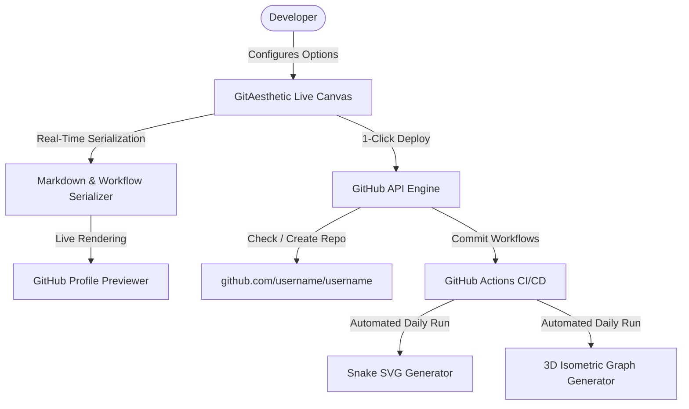

<div align="center">

  

  <p align="center">
    <strong>Design, customize, and automatically deploy animated GitHub profiles in 1 click.</strong>
  </p>

  <p align="center">
    
    
    
    
  </p>

</div>

---

## 🌟 Overview

**GitAesthetic** is an open-source developer tooling platform engineered to solve the complexity of creating high-end, dynamic GitHub profile READMEs. 

Instead of manually editing YAML workflows, struggling with GitHub Actions permissions, resolving browser caching issues, or debugging private contribution visibility, **GitAesthetic** allows any engineer to configure their profile visually with real-time preview and **deploy the entire repository, workflows, and README in 1 click**.

---

## 🚀 Key Features

* **⚡ True 1-Click GitHub Deployment**: Integrates with GitHub REST & GraphQL APIs to automatically create or update the special `<username>/<username>` repository, commit `.github/workflows/snake.yml`, `.github/workflows/profile-3d.yml`, and `README.md` in an atomic push.
* **🖥️ Real-Time Split-Screen Builder**: Responsive live canvas simulating GitHub's Dark UI container with instant markdown generation.
* **🎨 Curated Aesthetic Theme Presets**:
  * **Tokyo Night** (Dark indigo, electric cyan, vibrant purple)
  * **Cyberpunk Neon** (Deep black, hot magenta, neon blue)
  * **Catppuccin Mocha** (Soft pastel dark aesthetic)
  * **Dracula Classic** (Gothic high-contrast vampire theme)
  * **Nord Frost** (Arctic blue & crisp minimal dark)
* **🐍 Automated Contribution Visualizers**:
  * **Retro Snake Game**: Automated cron workflow eating contribution squares daily.
  * **3D Isometric City Graph**: Renders commit density as a 3D isometric city block inside a collapsible drawer.
* **✍️ Dynamic Cycling Typewriter**: Generates smooth SVG typing text animations highlighting technical roles without running server jobs.
* **🛠️ Categorized Tech Stack Grid**: Curated multi-select ecosystem for AI/ML, Frontend, Backend, Databases, and DevOps via SkillIcons.
* **🔄 Cache-Busting Architecture**: Automatically injects cache-busting version hashes to circumvent GitHub Camo proxy image retention.

---

## 🏗️ Architecture



---

## 🛠️ Tech Stack & Engineering Highlights

| Layer | Technologies |
|---|---|
| **Frontend** | Next.js 14 (App Router), React 18, TypeScript, Tailwind CSS |
| **Icons & Effects** | Lucide React, Canvas Confetti |
| **Integrations** | GitHub REST API v3, GitHub GraphQL API |
| **Automation** | GitHub Actions CI/CD (`Platane/snk`, `yoshi389111/github-profile-3d-contrib`) |
| **Deployment** | Vercel Serverless Platform |

---

## 💻 Getting Started Locally

### Prerequisites
* Node.js v18+ (Node v20 or v22 recommended)
* npm or yarn

### Installation

```bash
# 1. Clone the repository
git clone https://github.com/Gaurav1-4/git-aesthetic.git
cd git-aesthetic

# 2. Install dependencies
npm install

# 3. Start local development server
npm run dev
```

Open [http://localhost:3000](http://localhost:3000) with your browser to experience the application.

---

## 📄 Resume & Portfolio Summary

> **GitAesthetic | Full-Stack Developer Platform & GitHub Automation Tool**
> * **Tech Stack**: Next.js 14, TypeScript, Tailwind CSS, GitHub REST & GraphQL API, GitHub Actions
> * Built a developer tool automating the configuration and deployment of dynamic GitHub profiles, CI/CD workflows, and animated SVGs in a single click.
> * Implemented client-side live markdown rendering and an interactive theme engine supporting Tokyo Night, Cyberpunk, and Catppuccin color schemes.
> * Engineered an automated GitHub API deployment pipeline that provisions special user repositories, commits CI/CD automation pipelines, and resolves GitHub Camo caching bottlenecks.

---

## 📜 License

Distributed under the **MIT License**. See `LICENSE` for more information.

---

<div align="center">
  <p>Crafted with ❤️ by <a href="https://github.com/Gaurav1-4"><strong>Gaurav</strong></a></p>
</div>
